# Use Case Diagram - InaEEWS (Indonesia Earthquake Early Warning System)

## 📊 Gambaran Use Case Diagram

```
┌─────────────────────────────────────────────────────────────────────────┐
│                                                                         │
│                        InaEEWS System                                   │
│                                                                         │
│  ┌──────────────────────────────────────────────────────────────────┐  │
│  │                                                                  │  │
│  │  ┌─────────────┐                                               │  │
│  │  │   Public/  │                                               │  │
│  │  │  Citizens  │──┐                                            │  │
│  │  └─────────────┘  │                                           │  │
│  │                   │   ┌─────────────────────────────────┐     │  │
│  │  ┌──────────────┐ │   │  1. View Website Landing Page   │     │  │
│  │  │  Students/  │─┤───│  2. Learn About InaEEWS          │     │  │
│  │  │   Educator  │ │   │  3. Understand How It Works      │     │  │
│  │  └──────────────┘ │   │  4. View System Benefits         │     │  │
│  │                   │   │  5. Check Coverage Area          │     │  │
│  │  ┌──────────────┐ │   │  6. View System Diagrams         │     │  │
│  │  │   Officials/ │─┘   │  7. Receive FAQ Information      │     │  │
│  │  │    BMKG     │      │  8. View Roadmap & Timeline      │     │  │
│  │  └──────────────┘      └─────────────────────────────────┘     │  │
│  │         │                                                        │  │
│  │         └──────────────┬─────────────────────────────────────┐  │  │
│  │                        │                                     │  │  │
│  │                  ┌─────▼──────────────┐                     │  │  │
│  │  ┌────────────┐  │  9. Access Mobile  │                     │  │  │
│  │  │ App Users/ │──│     App            │                     │  │  │
│  │  │ Subscribers│  │  10. View Products │                     │  │  │
│  │  └────────────┘  │  11. Receive Early │                     │  │  │
│  │         │        │      Warnings       │                     │  │  │
│  │         │        │  12. Access        │                     │  │  │
│  │         │        │      Education     │                     │  │  │
│  │         │        │      Materials     │                     │  │  │
│  │         └────────┼──────────────────┘                       │  │  │
│  │                  │                                           │  │  │
│  │                  └────────────┬──────────────────────────────┘  │  │
│  │                               │                                 │  │
│  │                  ┌────────────▼─────────┐                      │  │
│  │                  │ 13. Contact/         │                      │  │
│  │                  │     Collaborate      │                      │  │
│  │                  └──────────────────────┘                      │  │
│  │                                                                  │  │
│  └──────────────────────────────────────────────────────────────────┘  │
│                                                                         │
└─────────────────────────────────────────────────────────────────────────┘
```

## 📋 Daftar Use Case Lengkap

### **Actors (Aktor):**
1. **General Users/Citizens** - Masyarakat umum yang ingin mempelajari sistem
2. **Students/Educators** - Pelajar dan guru yang mengakses materi edukasi
3. **Officials/BMKG** - Pegawai BMKG dan pemerintah
4. **Mobile App Users** - Pengguna aplikasi mobile InaEEWS
5. **Partners/Collaborators** - Mitra dalam pengembangan sistem

### **Use Cases:**

| No | Use Case | Deskripsi | Aktor Utama |
|:--:|----------|-----------|------------|
| 1 | **View Website Landing Page** | Mengakses halaman utama website InaEEWS | All Users |
| 2 | **Learn About InaEEWS** | Memahami definisi dan tujuan sistem | General Users |
| 3 | **Understand How It Works** | Melihat video penjelasan cara kerja sistem | General Users |
| 4 | **View System Benefits** | Melihat alasan/manfaat menggunakan InaEEWS | General Users |
| 5 | **Check Coverage Area** | Melihat area jangkauan sistem peringatan | All Users |
| 6 | **View System Diagrams** | Melihat arsitektur dan diagram teknis sistem | Officials |
| 7 | **Receive FAQ Information** | Mencari jawaban atas pertanyaan umum | General Users |
| 8 | **View Roadmap & Timeline** | Melihat rencana pengembangan dan timeline | Officials |
| 9 | **Access Mobile App** | Mengunduh dan menggunakan aplikasi mobile | Mobile Users |
| 10 | **View Products** | Melihat produk-produk InaEEWS (Mobile App, RSEEW, Warning Display, Cellular Broadcast) | All Users |
| 11 | **Receive Early Warnings** | Menerima notifikasi peringatan gempa dini | Mobile App Users |
| 12 | **Access Education Materials** | Mengakses materi pembelajaran (video, jurnal, bahan ajar) | Students/Educators |
| 13 | **Contact/Collaborate** | Menghubungi untuk kerjasama atau pertanyaan | Partners/Officials |

---

## 🔄 Mermaid Diagram Format

```mermaid
graph TB
    subgraph System["InaEEWS Website System"]
        UC1["1. View Landing Page"]
        UC2["2. Learn About InaEEWS"]
        UC3["3. Understand How It Works"]
        UC4["4. View System Benefits"]
        UC5["5. Check Coverage Area"]
        UC6["6. View System Diagrams"]
        UC7["7. Get FAQ Information"]
        UC8["8. View Roadmap"]
        UC9["9. Access Mobile App"]
        UC10["10. View Products"]
        UC11["11. Receive Warnings"]
        UC12["12. Access Education Materials"]
        UC13["13. Contact/Collaborate"]
    end

    subgraph Actors["Actors"]
        A1["👥 General Users"]
        A2["🎓 Students/Educators"]
        A3["👔 Officials/BMKG"]
        A4["📱 Mobile App Users"]
        A5["🤝 Partners"]
    end

    A1 -->|Uses| UC1
    A1 -->|Uses| UC2
    A1 -->|Uses| UC3
    A1 -->|Uses| UC4
    A1 -->|Uses| UC5
    A1 -->|Uses| UC7
    A1 -->|Uses| UC10

    A2 -->|Uses| UC12
    A2 -->|Uses| UC1
    A2 -->|Uses| UC7

    A3 -->|Uses| UC6
    A3 -->|Uses| UC8
    A3 -->|Uses| UC13

    A4 -->|Uses| UC9
    A4 -->|Uses| UC11
    A4 -->|Uses| UC10

    A5 -->|Uses| UC13
```



---

## 📱 Fitur-Fitur Utama per Halaman

### **Halaman Utama (Home)**
- Hero Section - Pengenalan InaEEWS
- How It Works - Video penjelasan cara kerja
- Reasons Section - Alasan menggunakan sistem
- Timeline - Sejarah pengembangan
- Golden Time Section - Informasi waktu emas respons
- FAQ Section - Pertanyaan yang sering diajukan
- Roadmap Section - Rencana pengembangan
- Collaborate Section - Ajakan kolaborasi

### **Halaman Tentang (About)**
- Wave Animation - Animasi gelombang seismik
- Coverage Area - Peta jangkauan sistem
- Task & Function - Tugas dan fungsi sistem
- Diagrams - Diagram teknis arsitektur

### **Halaman Edukasi (Education)**
- Hero Section - Pengenalan halaman edukasi
- Materials - Materi pembelajaran
- Videos - Video edukasi
- Journals - Jurnal dan publikasi

### **Halaman Produk (Product)**
- Hero Section - Pengenalan produk
- Mobile App - Informasi aplikasi mobile
- RSEEW - Rainfall-based Early Earthquake Warning
- Warning Display - Tampilan peringatan
- Cellular Broadcast - Broadcast lewat seluler

---

## 🎯 Analisis Use Case

### **Tujuan Utama Website:**
1. **Edukasi Publik** - Memberikan pemahaman tentang sistem InaEEWS
2. **Promosi Produk** - Menampilkan berbagai produk dan layanan
3. **Penyebaran Informasi** - Menyediakan materi edukatif dan FAQ
4. **Kolaborasi** - Memfasilitasi kerjasama dengan mitra dan stakeholder
5. **Keterlibatan Pengguna** - Mendorong pengguna untuk download aplikasi mobile

### **Skenario Pengguna Utama:**

**Skenario 1: Masyarakat Umum**
- Masuk ke halaman utama → Lihat video penjelasan → Pelajari manfaat → Cek jangkauan → Unduh aplikasi

**Skenario 2: Pelajar**
- Masuk halaman utama → Akses halaman edukasi → Belajar materi pembelajaran → Tonton video edukasi

**Skenario 3: Pengguna Mobile App**
- Unduh aplikasi → Terima notifikasi peringatan → Baca informasi produk → Bagikan informasi

**Skenario 4: Mitra/Stakeholder**
- Pelajari sistem → Lihat diagram teknis → Lihat roadmap → Hubungi untuk kolaborasi

---

## 💡 Rekomendasi Pengembangan

1. **Integrasi Live Alert** - Tambahkan feed peringatan gempa real-time
2. **User Authentication** - Sistem login untuk melacak pengguna
3. **Personalization** - Notifikasi berdasarkan lokasi pengguna
4. **Analytics** - Melacak interaksi dan engagement pengguna
5. **Social Sharing** - Opsi berbagi di media sosial
6. **Dark Mode** - Opsi tema gelap untuk kenyamanan mata
7. **Multi-language** - Support bahasa Inggris dan bahasa lainnya

---

*Diagram Use Case dibuat berdasarkan analisis struktur project Astro InaEEWS*
